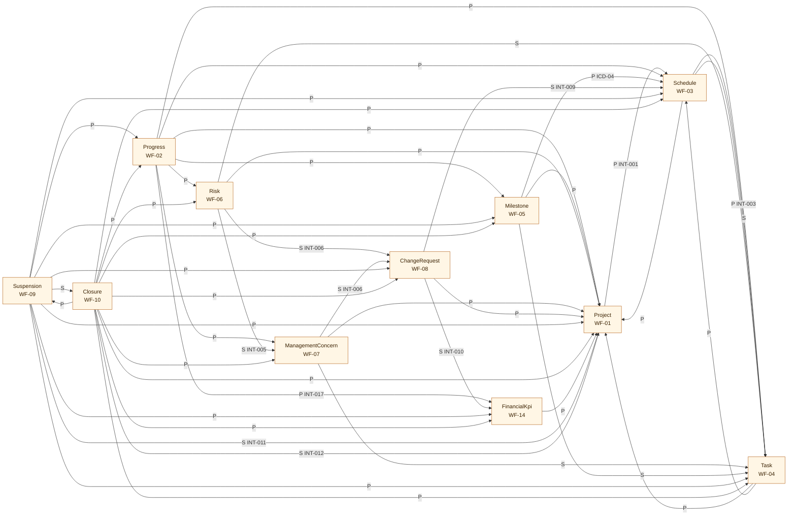

# Solution Architecture — Three-Tier Modular Monolith and Module Boundaries

| Control | Value |
|---|---|
| Task | TASK-007 — Define Three-Tier Solution Architecture & Module Boundaries (Phase P1 — Architecture Decisions, wave W0); depends on TASK-006 |
| Programme | AHDA Regional Project Management Platform (RPMO) |
| Governance row | Workbook ADR-003 *Solution architecture pattern* — Option A, modular monolith, one module per WF/FG domain (status **Proposed — Pending AHDA Approval**). This document is ADR-003's design record; it inherits ADR-002's status (ADR-002 §11 rule 5). |
| Issue date | 2026-09-19 |
| Document status | **ISSUED — design baseline for TASK-008/009/011/024 and every Backend/Frontend task; AHDA approval tracked on ADR-002/ADR-003, not here** |
| Owner | Engagement Architect |
| Source digests verified 2026-09-19 | CSB-BP2 `cb2b4675e3509160`; CSB-14A `e0a9c11e3c7c0dc1`; CSB-17 `d1a512e03517943c` / registers `3a4989e73ef397c5`; CSB-15 registers `aebc88944ca41a14`; CSB-CYBER-GUIDE `81b725edf83635c7`; workbook `0c0ff4b0b495ae25` — unchanged from TASK-001 |

Sources and precedence per TASK-001 (`docs/baseline/controlled-source-baseline.md`). Documents are cited by `CSB-*` register ID; INT-/EVT-/ICD- IDs are CSB-14A §15/§16/§22; BE- IDs are CSB-17 *Technical_Requirements*; BPK- IDs are CSB-15 *02_Build_Packages*; P- and API- IDs are CSB-BP2 §4 and §19. The stack, repository layout and module folder names are those of ADR-002 (`docs/architecture/adrs/ADR-002-technology-stack.md`, §5, §7.1, §7.2); waves are those of TASK-003; PTBC IDs those of TASK-004.

## 1. Decision statement

**How the platform is partitioned** — into three tiers (CSB-SCOPE ¶127–130; CSB-BP2 §22.1; API-01) and, inside the business-logic tier, into 21 bounded modules that map 1:1 to the controlled WF-01–WF-15 and FG-01–FG-06 register (CSB-BP2 §5, §6) — and **which module may call which**, by what mechanism, so that every cross-module write is a typed application-service call, event or callback and never a repository, `DbContext` or table access into another module's data (API-03; P-08; ICD-06; CSB-14A §15.1; BE-001; BE-025).

This document fixes: the tier boundary (§3); the module register (§4); the layering and call rules (§5); the complete edge register (§6, normative) and the diagrams derived from it (§7); the in-code shape of a module and the enforcement mechanism (§8); the frontend module structure (§9); and the Appendix D ownership crosswalk the workbook's validation note asks for (§10). It does not fix the entity model (TASK-008), wire-level API/event conventions (TASK-009), or hosting topology (ADR-001).

## 2. Context — what the sources require

| Source | Requirement | Effect on this design |
|---|---|---|
| CSB-SCOPE ¶127–130; CSB-BP2 §22 *Architecture* row, §22.1 | Three-tier presentation / business-logic API / data; front end never writes the database directly | §3 tier contract; the SPA holds no database credential and calls only `PMPlatform.Api` |
| CSB-BP2 §3 | One role-based transactional web application organised into six business/process areas and three platform capability areas; shared services support but do not own business facts | One deployable; module grouping in §4 mirrors P1–P9; L1/L0 modules never own L2 facts (§5) |
| CSB-BP2 §4 P-01, P-08; §19 API-01–API-03; CSB-14A ICD-06, §15.1 | One owner per fact; cross-domain mutation only through typed APIs/events/adapters; direct cross-domain DB writes prohibited | Edge types S/P/E/C only (§5.2); type R is prohibited and mechanically checked (§8.4, §11) |
| CSB-BP2 §5, §6 | The 15 workflows and 6 feature groups with primary responsibility and lifecycle authority | 21 modules, one per register row (§4); no module for "Project Activation" — it is a Project-master command (CSB-BP2 §5 note; ICD-02) |
| CSB-BP2 §7 | Process areas are organisational, create no additional owners or numbers | Areas appear as a column in §4, not as an architectural layer |
| CSB-BP2 §8, Appendix D | 33-row ownership register; ProjectMilestone is the single explicit split | §10 crosswalk: 31 single-owner rows, 1 modeled split pair (ProjectMilestone), 1 rule split (EvidenceReference) |
| CSB-14A §15 INT-001–030, §16 EVT-001–024, §8–§14 | The interaction contracts, their producers/consumers, idempotency and failure rules | Every edge in §6 cites its INT/EVT/ICD basis; edges without a basis in a rank-1–3 source are not drawn |
| CSB-17 BE-001 | "Logical domain modules with controlled data-access interfaces; deployment topology and database engine remain a design decision" | Modular monolith (ADR-003 Option A) on ADR-002's engine; one process, one database, one schema per module (§3.3) |
| CSB-17 BE-005–007, BE-025 | Expected-version concurrency, idempotency ledger, transactional outbox, no cross-domain cascade writes | Module kernel (§8.3); per-module outbox/inbox/idempotency tables inside the module schema |
| CSB-CYBER-GUIDE §3.1–§3.5 | Tier responsibilities; logical separation suffices locally, must remain separated in hosting | §3; local compose runs the three tiers as three containers (TASK-014) |
| Workbook ADR-003 | Modular monolith chosen so the design "can be split into services later if AHDA's scale changes" | Module-private schemas, contract-only references and per-module outbox are the split-readiness conditions (§8.5) |

## 3. Three-tier contract (API-01)

### 3.1 Tiers

| Tier | Realisation (ADR-002 §7.1) | Owns | Never |
|---|---|---|---|
| **T1 Presentation** | `src/frontend` — React 19 + TypeScript SPA (Vite), served as static assets from an nginx container behind the ingress / WAF (ADR-001) | Rendering, navigation, Arabic/English + RTL, client-side UX validation, session token handling | Holds a database credential or connection string; reaches PostgreSQL or object storage; decides authorization (CSB-BP2 §10.2: hidden UI controls are not security controls); calls anything but `PMPlatform.Api` over HTTPS |
| **T2 Business logic / API** | `src/backend` — one ASP.NET Core (.NET 10 LTS) deployable: `PMPlatform.Api` host + `PMPlatform.Application` + `PMPlatform.Domain` + `PMPlatform.Infrastructure`, built as one OCI image | Authentication, authorization (INT-023), validation, every business rule and lifecycle transition, module boundaries (§5), outbox dispatch, scheduled work, integration adapters, audit emission | Lets the presentation tier bypass it; lets one module reach another module's tables (§5.2 type R) |
| **T3 Data** | PostgreSQL 17+ (ADR-002 §4.1) — database `pmplatform`, one schema per module; object storage for `DocumentVersion` binaries (WF-12) via `Infrastructure/<Provider>` | Durable state, integrity constraints within a module schema, PITR backup (ADR-001 C7) | Accepts a connection from anything but T2 (network policy per ADR-001; guide §3.3); stores business rules (no triggers/stored procedures implementing lifecycle logic — BE-001 "controlled data-access interfaces") |

### 3.2 Request path (CSB-17 *Protected command path*)

Browser → HTTPS → ingress/WAF → `PMPlatform.Api` endpoint → authenticate → `IdentityAccess` authorization (INT-023) → module application service: expected-version and state check (BE-005) → `MasterDataConfig` resolution (INT-022) → business validation → **one local transaction** in the module's schema that writes the aggregate, the AuditEvent capture obligation and the outbox rows (BE-007) → commit → response with committed version → outbox dispatcher delivers events/callbacks/intents to consuming modules (in-process) and adapters. Nothing in this path lets T1 or another module write the module's tables.

### 3.3 Process and data topology

- **One process image, two roles.** The same `PMPlatform.Api` image runs as role `api` (HTTP endpoints) and role `worker` (outbox dispatcher, inbox processors, scheduled reminders/report jobs, reconciliation runs), selected by configuration. At MVP scale (150 named users, workbook ADR-003) one replica of each is sufficient; the worker can be scaled or isolated without a code change.
- **One database, module-private schemas.** Schema names are in §4. A module's `DbContext` maps its own schema only. There are no cross-schema foreign keys and no cross-schema cascades (BE-025); cross-module references are typed identifiers validated through the callee's contract at write time.
- **Kernel tables per module.** `outbox_message`, `inbox_message` (consumer de-duplication by stable event ID, BE-007) and `idempotency_record` (BE-006) exist in every module schema, written in the module's own transaction. A single shared outbox table would create the cross-module write the design forbids.
- **Object storage** is reached only by `DocumentManagement` (upload/download/scan) and `Reports` (generated outputs) through `Infrastructure/<Provider>` adapters; storage paths are never authorization tokens (CSB-BP2 §13).
- **Search index** for FG-06 Activity/Audit search is a rebuildable PostgreSQL full-text index inside `audit_activity` at MVP; a separate engine is a PTBC-045 decision, not this document's.

## 4. Module register (CSB-BP2 §5–§6, 1:1)

Module identifiers are the ADR-002 §7.2 backend folder names, unchanged (finding 007-F-001 closes 006-F-004: six modules are named differently in the TASK-007 workbook brief; the folder names are canonical because 22 workbook rows already use them, three are plural and stay plural). The identifier is used for the `Features/<Module>` folder, the `PMPlatform.Domain/<Module>` folder, the `Infrastructure/Persistence/<Module>` folder, the `Migrations/<Module>` folder, the C# root namespace segment and, in snake_case, the PostgreSQL schema.

| # | Module ID (backend `Features/<Module>`, schema) | WF/FG | CSB-BP2 §5/§6 name | §3 area | Layer | Backend task | Frontend `features/<feature>` (task) | Step 15 package |
|---|---|---|---|---|---|---|---|---|
| 1 | `Project` · `project` | WF-01 | Project Creation & Registration | P1 | L2 | TASK-041 | `projects` (TASK-042) | BPK-014 |
| 2 | `Progress` · `progress` | WF-02 | Project Progress Update | P2 | L2 | TASK-044 | `progress` (TASK-045) | BPK-022 |
| 3 | `Schedule` · `schedule` | WF-03 | Schedule & Baseline Management | P2 | L2 | TASK-046 | `schedule` (TASK-047) | BPK-015 |
| 4 | `Task` · `task` | WF-04 | Task Management | P2 | L2 | TASK-048 | `tasks` (TASK-049) | BPK-016 |
| 5 | `Milestone` · `milestone` | WF-05 | Milestone Management | P2 | L2 | TASK-050 | `milestones` (TASK-051) | BPK-017 |
| 6 | `Risk` · `risk` | WF-06 | Risk Management | P3 | L2 | TASK-055 | `risks` (TASK-056) | BPK-018 |
| 7 | `ManagementConcern` (TASK-007 brief: `Concern`) · `management_concern` | WF-07 | Issue & Challenge Management | P3 | L2 | TASK-057 | `issues-challenges` (TASK-058) | BPK-019 |
| 8 | `ChangeRequest` (TASK-007 brief: `Change`) · `change_request` | WF-08 | Project Change Request | P4 | L2 | TASK-060 | `change-requests` (TASK-061) | BPK-020 |
| 9 | `Suspension` · `suspension` | WF-09 | Project Suspension & Resumption | P4 | L2 | TASK-062 | `suspension-closure` (TASK-064) | BPK-024 |
| 10 | `Closure` · `closure` | WF-10 | Project Completion & Closure | P4 | L2 | TASK-063 | `suspension-closure` (TASK-064) | BPK-025 |
| 11 | `Approval` · `approval` | WF-11 | Shared Approval Framework | P4 | L1 | TASK-035 | `approvals` (TASK-036) | BPK-011 |
| 12 | `DocumentManagement` (TASK-007 brief: `Document`) · `document_management` | WF-12 | Document Management | P5 | L1 | TASK-037 | `documents` (TASK-038) | BPK-010 |
| 13 | `ExternalParticipation` · `external_participation` | WF-13 | External Entity Update & Review | P5 | L3 | TASK-066 | `external-participation` (TASK-067) | BPK-023 |
| 14 | `FinancialKpi` · `financial_kpi` | WF-14 | KPI & Financial Progress | P2 | L2 | TASK-052 | `financial-kpi` (TASK-053) | BPK-021 |
| 15 | `Notifications` (TASK-007 brief: `Notification`) · `notifications` | WF-15 | Notifications, Reminders & Escalations | P6 | L1 | TASK-039 | `notifications` (TASK-040) | BPK-012 |
| 16 | `Dashboards` (TASK-007 brief: `Dashboard`) · `dashboards` | FG-01 | Dashboards | P7 | L4 | TASK-069 | `dashboards` (TASK-070) | BPK-026 |
| 17 | `Reports` (TASK-007 brief: `Report`) · `reports` | FG-02 | Reports, Filters & Export | P7 | L4 | TASK-071 | `reports` (TASK-072) | BPK-027 |
| 18 | `IdentityAccess` · `identity_access` | FG-03 | Users, Roles & Permissions | P8 | L0 | TASK-031 | `identity-access` (TASK-032) | BPK-006 |
| 19 | `MasterDataConfig` · `master_data_config` | FG-04 | Master Data & Configuration | P8 | L0 | TASK-034 | `master-data-config (reserved)` (— no task, 006-F-005) | BPK-007 |
| 20 | `IntegrationMonitoring` · `integration_monitoring` | FG-05 | Integration Monitoring | P9 | L0 | TASK-075 | `integration-admin` (TASK-076) | BPK-009 |
| 21 | `AuditActivity` · `audit_activity` | FG-06 | Audit & Activity | P9 | L0 | TASK-033, 073 | `audit-activity` (TASK-074) | BPK-008 |

Rules that follow:

- Exactly one module per WF/FG row and one WF/FG row per module: 15 + 6 = 21. No module exists for "Project Activation", "Portfolio", "Search", "Workflow engine" or any other name not in CSB-BP2 §5–§6; cross-cutting code that is not a domain lives in the kernel (§8.3), not in a 22nd module.
- The two frontend composites (`progress` carries WF-02 screens and the WF-02/WF-03 progress views of TASK-045; `suspension-closure` carries WF-09 + WF-10) are presentation groupings only; each still talks to two backend modules through their own endpoints.
- `FG-04` has a backend module and a reserved frontend feature with no workbook task (006-F-005, carried as 007-F-008).

## 5. Layering and call rules

### 5.1 Layers

Layers exist to make call direction checkable. They are derived from CSB-BP2 §3 ("shared services support, but do not take ownership from, business domains") and from CSB-15's foundation packages BPK-006–013, which must exist before the business slices that consume them.

| Layer | Modules | Why this layer |
|---|---|---|
| **L0 Platform foundations** | `IdentityAccess` (FG-03), `MasterDataConfig` (FG-04), `IntegrationMonitoring` (FG-05), `AuditActivity` (FG-06) | Consumed synchronously by every other module (INT-022/023) or fed by every other module (INT-024/026); own no business fact of any workflow (App D). BPK-006–009. |
| **L1 Shared runtimes** | `Approval` (WF-11), `DocumentManagement` (WF-12), `Notifications` (WF-15) | Reusable runtimes that "never silently mutate the source business object" (CSB-BP2 §11, §13, §15); invoked by source workflows, reply only through callbacks/events. BPK-010–012. |
| **L2 Source business domains** | `Project` (WF-01) and `Progress`, `Schedule`, `Task`, `Milestone`, `Risk`, `ManagementConcern`, `ChangeRequest`, `Suspension`, `Closure`, `FinancialKpi` | Own the business facts (App D rows 1–17, 24–25). `Project` is drawn separately because every other L2 module reads it and two (WF-09/WF-10) command its lifecycle. BPK-014–022, 024–025. |
| **L3 External intake** | `ExternalParticipation` (WF-13) | Stages external input and applies it *into* L2 through typed contracts (INT-016); never authoritative by itself (P-12, ICD-07). BPK-023. |
| **L4 Management intelligence** | `Dashboards` (FG-01), `Reports` (FG-02) | Pure consumers of governed projections (INT-019/020, ICD-10); own only definitions, jobs and outputs (App D rows 28–29). BPK-026–027. |

### 5.2 Edge types — the only permitted mechanisms

| Type | Mechanism | Direction rule | Transaction boundary | Source basis |
|---|---|---|---|---|
| **S** — synchronous application-service call | Caller invokes a typed command on the callee's `Contracts` interface, in-process; callee validates authorization, state and version itself (API-02) | To the same or a lower layer only | Callee's own transaction; caller receives committed result/version or a durable operation reference (BE-008) | API-03; ICD-06; BE-005/006 |
| **P** — projection read | Caller invokes a typed read-model query on the callee's `Contracts.Projections`; result carries semantic state, as-of, freshness and coverage metadata (BPK-013) | To the same or a lower layer only | None (read-only) | INT-019/020; ICD-10/11; BE-010 |
| **E** — integration event | Caller writes an event to its own `outbox_message` in the same transaction as its state change; dispatcher delivers to subscribing modules' inbox handlers; consumers de-duplicate by event ID | Any direction | Producer's transaction (write) and each consumer's own transaction (handle) | INT-018/026; BE-007; API-04/05 |
| **C** — durable callback | As E, but carries a decision outcome for a specific pinned source revision (WF-11 → source); the source revalidates and performs its own transition | Any direction (used upward L1 → L2) | As E | INT-008/014; EVT-012; ICD-05; BE-003 |
| **R** — direct repository / `DbContext` / table access into another module's schema | — | **Prohibited** | — | API-03; P-08; ICD-06; BE-025 |

Consequences: no distributed transaction exists anywhere (CSB-17 *Approval and source application*); every cross-module effect is either a completed synchronous call with a version or an at-least-once event with consumer de-duplication; a technical retry of an E/C never creates a second business result (BE-006, API-07).

### 5.3 Compile-time reference rule

Runtime direction (above) and compile-time dependency are different things. A module may reference **only** another module's `Contracts` namespace (interfaces, command/query/projection DTOs, event records). It may never reference another module's handlers, domain entities, repository interfaces, `DbContext`, or `Infrastructure/Persistence/<Module>`. `Contracts` namespaces reference nothing but the kernel primitives (§8.3). Contract-level reference cycles are therefore harmless (e.g. `Notifications` → `IdentityAccess.Contracts` for recipient facts while `IdentityAccess` → `Notifications.Contracts` to emit an intent); implementation-level cycles are impossible by construction. §8.4 states the architecture tests that enforce this.

## 6. Edge register (normative)

The register is the authoritative statement of allowed calls; `docs/architecture/module-dependency-register.csv` is its pairwise machine-readable form (one row per edge, used as the fixture for architecture test A6 in §8.4). A call not in this register is not allowed until the register is revised under §13. Rows are grouped; the last column is the number of pairwise module edges the row expands to. Totals: **276 pairwise baseline edges** — S 80, P 66, E 125, C 5, **R 0** — over all 21 modules, plus 6 policy-gated edges in §6.3 that are excluded from the baseline.

### 6.1 Synchronous calls and projection reads (S, P) — one row per contract

| # | Callers (initiators) | → Callees | Type | Contract basis | Purpose | Pairwise edges |
|---|---|---|---|---|---|---|
| 1 | all modules except `IdentityAccess` | `IdentityAccess` | S | INT-023; ICD-12; BE-002 | Authorize action / scope / relationship / assignment / state / sensitivity for every protected operation | 20 |
| 2 | all modules except `MasterDataConfig`, `IdentityAccess` | `MasterDataConfig` | S | INT-022; ICD-13; BE-004; CSB-14A §9 | ResolveConfiguration(configType, businessContext, effectiveDate); pin applied version | 19 |
| 3 | `Progress`, `Schedule`, `Task`, `Milestone`, `Risk`, `ManagementConcern`, `ChangeRequest`, `Suspension`, `Closure`, `ExternalParticipation`, `FinancialKpi` | `Project` | P | CSB-BP2 App D row 1; CSB-BP2 §9 | Read Project identity and lifecycle state; consumers reference, never clone | 11 |
| 4 | `Dashboards`, `Reports` | `Project` | P | CSB-BP2 App D row 1; CSB-BP2 §9; INT-019; INT-020; ICD-10; ICD-11; BE-010; BE-022; BPK-013 | Read Project identity and lifecycle state; consumers reference, never clone · Governed projections with semantic state, as-of, freshness, coverage and sensitivity; no raw table querying | 2 |
| 5 | `Project`, `Schedule`, `ChangeRequest`, `Suspension`, `Closure` | `Approval` | S | INT-013; INT-007; CSB-14A §8; BE-003 | Create approval instance for a frozen source revision (registration, baseline, change, suspension, completion / closure) | 5 |
| 6 | all 11 L2 modules, `ExternalParticipation`, `Reports` | `DocumentManagement` | S | INT-015; INT-030; ICD-08; BE-018; CSB-14A §10 | Create / link / pin exact CLEAN DocumentVersion as evidence; FG-02 promotes retained Report Snapshot | 13 |
| 7 | `Project` | `Schedule` | P | INT-001; ICD-02; BE-011 | Activation readiness (baseline / schedule) read at Planned→Active command | 1 |
| 8 | `Progress` | `FinancialKpi` | P | INT-017; EVT-016; BE-014 | Current / published financial and KPI projections pinned by source version and as-of at reporting cut-off | 1 |
| 9 | `Progress` | `Schedule`, `Task`, `Milestone`, `Risk`, `ManagementConcern` | P | CSB-WF-02 §9.23 / §9.24 dependency tables (read via ICD-01 renumbering); BE-014 | Planned progress, physical-progress weighting, schedule health, task / milestone statistics, risk and concern summaries at reporting cut-off | 5 |
| 10 | `Schedule` | `Task` | P | INT-003 | Activity Execution Progress from linked Tasks; WF-03 never recalculates Tasks | 1 |
| 11 | `Schedule`, `Risk`, `ManagementConcern`, `Milestone` | `Task` | S | CSB-BP2 App D (Task / Subtask row) | Link / create Tasks through the WF-04 typed contract | 4 |
| 12 | `Task` | `Schedule` | P | CSB-BP2 App D (ProjectSchedule row: WF-04 links execution Tasks) | Read Schedule Activity identity for Task linkage | 1 |
| 13 | `Milestone` | `Schedule` | P | ICD-04; BE-013 | Read stable ProjectMilestone identity and planned dates (split authority) | 1 |
| 14 | `Risk` | `ManagementConcern` | S | INT-005; EVT-007; BE-015 | Materialize realized Risk into linked Issue (idempotent; pending-link state on partial failure) | 1 |
| 15 | `Risk`, `ManagementConcern` | `ChangeRequest` | S | INT-006; EVT-008 | Create / link Change Request where a controlled commitment change is required | 2 |
| 16 | `ChangeRequest` | `Schedule` | S | INT-009; BE-012; BE-016 | Apply scoped, version-pinned ChangeAuthorization to rebaseline candidate | 1 |
| 17 | `ChangeRequest` | `FinancialKpi` | S | INT-010; BE-016; BE-020 | Apply authorized budget / KPI target change | 1 |
| 18 | `Suspension` | `Project` | S | INT-011; BE-017 | Activate Suspension / Resumption on the Project master lifecycle (max one ActiveSuspension) | 1 |
| 19 | `Suspension` | `Progress`, `Schedule`, `Task`, `Milestone`, `ChangeRequest`, `FinancialKpi` | P | CSB-WF-09 §2 domain table | Capability signals and readiness references for the Resumption readiness snapshot | 6 |
| 20 | `Suspension` | `Closure` | S | CSB-WF-09 §2 (Closure row); CSB-WF-10 §2.1 (WF-09 row) | Refer a non-resuming Project for terminal disposition | 1 |
| 21 | `Closure` | `Project` | S | INT-012; BE-017 | Activate Completed / Closed; enforce terminal read-only behaviour | 1 |
| 22 | `Closure` | `Progress`, `Schedule`, `Task`, `Milestone`, `Risk`, `ManagementConcern`, `ChangeRequest`, `Suspension`, `FinancialKpi`, `DocumentManagement` | P | CSB-WF-10 §2.1 ownership matrix; CSB-BP2 App D (Completion / Closure case row) | Readiness / disposition gate projections (final report, reconciliation, dispositions, residuals, obligations, closeout completeness) | 10 |
| 23 | `ExternalParticipation` | all 11 L2 modules | S | INT-016; ICD-07; EVT-014; EVT-015; BE-019 | Apply accepted External Contribution through the target domain's allowlisted typed adapter; acknowledgment required before Applied | 11 |
| 24 | `Dashboards`, `Reports` | `Progress`, `Schedule`, `Task`, `Milestone`, `Risk`, `ManagementConcern`, `ChangeRequest`, `Suspension`, `Closure`, `FinancialKpi`, `ExternalParticipation`, `Approval`, `IntegrationMonitoring` | P | INT-019; INT-020; ICD-10; ICD-11; BE-010; BE-022; BPK-013 | Governed projections with semantic state, as-of, freshness, coverage and sensitivity; no raw table querying | 26 |
| 25 | `Reports` | `AuditActivity` | P | INT-027; BE-024 | Authorized formal Audit export dataset (same or stricter redaction) | 1 |

### 6.2 Events and callbacks (E, C) — one row per contract

| # | Producers | → Consumers | Type | Contract basis | Purpose | Pairwise edges |
|---|---|---|---|---|---|---|
| 1 | all modules except `AuditActivity`, `Dashboards`, `Reports`, `IdentityAccess`, `MasterDataConfig` | `AuditActivity` | E | INT-026; ICD-15; BE-007 | Publish durable typed AuditEvent for material business / admin / security actions | 16 |
| 2 | `Dashboards`, `Reports` | `AuditActivity` | E | INT-026; ICD-15; BE-007; EVT-018; EVT-019 | Publish durable typed AuditEvent for material business / admin / security actions · DashboardDefinitionPublished / ReportDefinitionPublished / ExportCompleted | 2 |
| 3 | `IdentityAccess` | `AuditActivity` | E | INT-026; ICD-15; BE-007; EVT-020 | Publish durable typed AuditEvent for material business / admin / security actions · AccessGranted / AccessRevoked → authorization-cache invalidation; WF-11 inactive-assignee handling (CSB-FG-03 US-IAM-SYS-040) | 1 |
| 4 | `MasterDataConfig` | `AuditActivity` | E | INT-026; ICD-15; BE-007; EVT-021 | Publish durable typed AuditEvent for material business / admin / security actions · ConfigurationPublished / Activated → consumers refresh resolution cache; pinned versions unaffected | 1 |
| 5 | `Project`, `Progress`, `Schedule`, `Task`, `Milestone`, `Risk`, `ManagementConcern`, `ChangeRequest`, `Suspension`, `Closure`, `DocumentManagement`, `ExternalParticipation`, `FinancialKpi`, `Reports` | `Notifications` | E | INT-018; ICD-09; BE-021; CSB-14A §11 | Emit typed NotificationIntent after durable commit (FG-03 per CSB-FG-03 US-IAM-PFM-010/DM-011/LIA-006/007/EXT-007; FG-05 INT-025; FG-06 EVT-024; FG-02 EVT-019; WF-11/WF-12 per CSB-BP2 §11/§13) | 14 |
| 6 | `Approval` | `Notifications` | E | INT-018; ICD-09; BE-021; CSB-14A §11; CSB-BP2 §11 (WF-15 supplies assignment / reminder / escalation / outcome delivery) | Emit typed NotificationIntent after durable commit (FG-03 per CSB-FG-03 US-IAM-PFM-010/DM-011/LIA-006/007/EXT-007; FG-05 INT-025; FG-06 EVT-024; FG-02 EVT-019; WF-11/WF-12 per CSB-BP2 §11/§13) · Assignment, reminder, escalation and outcome intents | 1 |
| 7 | `IdentityAccess` | `Notifications` | E | INT-018; ICD-09; BE-021; CSB-14A §11; EVT-020 | Emit typed NotificationIntent after durable commit (FG-03 per CSB-FG-03 US-IAM-PFM-010/DM-011/LIA-006/007/EXT-007; FG-05 INT-025; FG-06 EVT-024; FG-02 EVT-019; WF-11/WF-12 per CSB-BP2 §11/§13) · AccessGranted / AccessRevoked → authorization-cache invalidation; WF-11 inactive-assignee handling (CSB-FG-03 US-IAM-SYS-040) | 1 |
| 8 | `IntegrationMonitoring` | `Notifications` | E | INT-018; ICD-09; BE-021; CSB-14A §11; INT-025; EVT-022; EVT-023 | Emit typed NotificationIntent after durable commit (FG-03 per CSB-FG-03 US-IAM-PFM-010/DM-011/LIA-006/007/EXT-007; FG-05 INT-025; FG-06 EVT-024; FG-02 EVT-019; WF-11/WF-12 per CSB-BP2 §11/§13) · Operational alert / recovery / dead-letter intents | 1 |
| 9 | `AuditActivity` | `Notifications` | E | INT-018; ICD-09; BE-021; CSB-14A §11; EVT-024 | Emit typed NotificationIntent after durable commit (FG-03 per CSB-FG-03 US-IAM-PFM-010/DM-011/LIA-006/007/EXT-007; FG-05 INT-025; FG-06 EVT-024; FG-02 EVT-019; WF-11/WF-12 per CSB-BP2 §11/§13) · AuditIntegrityFailure / AuditIndexRecovered | 1 |
| 10 | `IdentityAccess` | `IntegrationMonitoring` | E | INT-024; INT-029; CSB-14A §13; EVT-020 | Adapter / runtime telemetry: invocation, sync run, queue, dead letter, reconciliation, audit-infrastructure signals · AccessGranted / AccessRevoked → authorization-cache invalidation; WF-11 inactive-assignee handling (CSB-FG-03 US-IAM-SYS-040) | 1 |
| 11 | `Notifications`, `DocumentManagement`, `FinancialKpi`, `ExternalParticipation`, `Reports`, `Dashboards` | `IntegrationMonitoring` | E | INT-024; INT-029; CSB-14A §13 | Adapter / runtime telemetry: invocation, sync run, queue, dead letter, reconciliation, audit-infrastructure signals | 6 |
| 12 | `AuditActivity` | `IntegrationMonitoring` | E | INT-024; INT-029; CSB-14A §13; EVT-024 | Adapter / runtime telemetry: invocation, sync run, queue, dead letter, reconciliation, audit-infrastructure signals · Audit infrastructure health / lag / integrity signals | 1 |
| 13 | `MasterDataConfig` | `IntegrationMonitoring` | E | EVT-021 | ConfigurationPublished / Activated (operational thresholds and health policy) | 1 |
| 14 | `Approval` | `Project`, `Schedule`, `ChangeRequest`, `Suspension`, `Closure` | C | INT-014; INT-008; EVT-012; BE-003; BE-006 | Durable idempotent approve / reject / return callback; source performs its own transition | 5 |
| 15 | `DocumentManagement` | all 11 L2 modules, `ExternalParticipation`, `Reports` | E | EVT-013 | DocumentVersionClean / Quarantined; source decides evidence sufficiency | 13 |
| 16 | `Project` | all L2 modules except `Project`, plus `Dashboards`, `Reports` | E | EVT-001; EVT-002; EVT-010; EVT-011 | ProjectRegistered / ProjectApproved / ProjectActivated · ProjectSuspended / ProjectResumed / ProjectCompleted / ProjectClosed — emitted by the Project master after the WF-09 / WF-10 command succeeds; each domain applies its own suspended / terminal behaviour | 12 |
| 17 | `Progress` | `Dashboards`, `Reports`, `Closure` | E | EVT-003 | ProgressPublished (official snapshot, period / version / as-of) | 3 |
| 18 | `Schedule` | `Progress`, `Dashboards`, `Reports` | E | EVT-004 | BaselineActivated / RebaselineActivated | 3 |
| 19 | `Task` | `Schedule` | E | EVT-005 | TaskStatusChanged / TaskCompleted → WF-03 projection refresh | 1 |
| 20 | `Milestone` | `Schedule`, `Progress`, `Dashboards`, `Reports` | E | INT-004; EVT-006 | MilestoneAchievementAccepted (accepted Actual Achievement Date) | 4 |
| 21 | `ChangeRequest` | `Dashboards`, `Reports` | E | EVT-009 | ChangeApproved / ChangeAuthorizationCreated | 2 |
| 22 | `FinancialKpi` | `Progress`, `Dashboards`, `Reports` | E | EVT-016 | FinancialSnapshotPublished / KPIMeasurementPublished | 3 |
| 23 | `ExternalParticipation` | `Dashboards`, `Reports` | E | EVT-015 | ExternalContributionApplied lineage | 2 |
| 24 | `IdentityAccess` | all modules except `IdentityAccess`, `Notifications`, `IntegrationMonitoring`, `AuditActivity` | E | EVT-020 | AccessGranted / AccessRevoked → authorization-cache invalidation; WF-11 inactive-assignee handling (CSB-FG-03 US-IAM-SYS-040) | 17 |
| 25 | `MasterDataConfig` | all modules except `MasterDataConfig`, `IdentityAccess`, `IntegrationMonitoring`, `AuditActivity` | E | EVT-021 | ConfigurationPublished / Activated → consumers refresh resolution cache; pinned versions unaffected | 17 |
| 26 | `IntegrationMonitoring` | `Dashboards` | E | EVT-022 | High-level integration health | 1 |

### 6.3 Policy-gated edges — not in the baseline

These exist in CSB-14A §8 as conditional; they are enabled only when AHDA names the configuration families (finding 007-F-004). `MasterDataConfig` → `Approval` is the single edge in the source set that would call upward (L0 → L1) synchronously; it is admissible only under the §5.3 contract rule and is drawn dashed.

| # | Callers | → Callees | Type | Contract basis | Purpose | Pairwise edges |
|---|---|---|---|---|---|---|
| 1 | `Progress`, `Milestone` | `Approval` | S | INT-013; CSB-14A §8 (CONDITIONAL / DOMAIN REVIEW by default) | Invoke WF-11 only where governance configuration requires formal approval | 2 |
| 2 | `Approval` | `Progress`, `Milestone` | C | INT-014 (only where the conditional WF-02 / WF-05 → WF-11 edge is enabled) | Approval outcome callback for conditionally approved progress publication / milestone acceptance | 2 |
| 3 | `MasterDataConfig` | `Approval` | S | CSB-14A §8 (FG-04 row: OPTIONAL / policy-driven; exact families TBC) | Sensitive configuration publication routed through WF-11 — the only upward synchronous call; excluded from the baseline until AHDA names the families | 1 |
| 4 | `Approval` | `MasterDataConfig` | C | INT-014 (only if the FG-04 → WF-11 edge is enabled) | Approval outcome callback for configuration publication | 1 |

Note on INT-021 (FG-01 → FG-02 dashboard filter context): this is a presentation-tier deep link whose context "is candidate input, never authorization token" (CSB-14A §15); `Reports` re-authorizes on receipt. It is a frontend route, not a backend edge, and is therefore absent from the register. INT-028 (FG-06 → SIEM) and the AD/LDAP, OIDC, Nafath, SMTP, storage and malware-scan connections are adapter edges from a module to an external system through `Infrastructure/<Provider>`, not module-to-module edges; their telemetry edge to `IntegrationMonitoring` (INT-024) is in §6.2.

## 7. Module dependency diagrams (derived from §6)

Node colour = layer. Solid arrows = S (command) or P (read); dashed = C (callback) or E (event) or a policy-gated S. An arrow from a layer box means every module in that box. Direction is initiator → receiver.

### 7.1 Figure 1 — complete call graph: all 21 modules, synchronous calls, reads and callbacks

L2 lateral calls are collapsed into the L2 box here and expanded in Figure 2.

```mermaid
flowchart TB
  subgraph L4["L4 Management intelligence — FG-01 / FG-02"]
    direction LR
    Dashboards["Dashboards<br/>FG-01"]
    Reports["Reports<br/>FG-02"]
  end
  subgraph L3["L3 External intake — WF-13"]
    direction LR
    ExternalParticipation["ExternalParticipation<br/>WF-13"]
  end
  subgraph L2a["L2 Project master — WF-01"]
    direction LR
    Project["Project<br/>WF-01"]
  end
  subgraph L2b["L2 Source business domains — WF-02…WF-10, WF-14 (lateral calls: Figure 2)"]
    direction LR
    Progress["Progress<br/>WF-02"]
    Schedule["Schedule<br/>WF-03"]
    Task["Task<br/>WF-04"]
    Milestone["Milestone<br/>WF-05"]
    Risk["Risk<br/>WF-06"]
    ManagementConcern["ManagementConcern<br/>WF-07"]
    ChangeRequest["ChangeRequest<br/>WF-08"]
    Suspension["Suspension<br/>WF-09"]
    Closure["Closure<br/>WF-10"]
    FinancialKpi["FinancialKpi<br/>WF-14"]
  end
  subgraph L1["L1 Shared runtimes — WF-11 / WF-12 / WF-15"]
    direction LR
    Approval["Approval<br/>WF-11"]
    DocumentManagement["DocumentManagement<br/>WF-12"]
    Notifications["Notifications<br/>WF-15"]
  end
  subgraph L0["L0 Platform foundations — FG-03 / FG-04 / FG-05 / FG-06"]
    direction LR
    IdentityAccess["IdentityAccess<br/>FG-03"]
    MasterDataConfig["MasterDataConfig<br/>FG-04"]
    IntegrationMonitoring["IntegrationMonitoring<br/>FG-05"]
    AuditActivity["AuditActivity<br/>FG-06"]
  end
  L4 & L3 & L2a & L2b & L1 -->|S INT-023 authorize| IdentityAccess
  MasterDataConfig & IntegrationMonitoring & AuditActivity -->|S INT-023| IdentityAccess
  L4 & L3 & L2a & L2b & L1 -->|S INT-022 resolve configuration| MasterDataConfig
  IntegrationMonitoring & AuditActivity -->|S INT-022| MasterDataConfig
  L4 & L3 & L2b -->|P Project identity and lifecycle| Project
  Suspension -->|S INT-011| Project
  Closure -->|S INT-012| Project
  Project -->|P INT-001 readiness| Schedule
  Project & Schedule & ChangeRequest & Suspension & Closure -->|S INT-013 create approval| Approval
  Progress & Milestone -.->|S conditional CSB-14A s.8| Approval
  Approval -.->|C INT-014 outcome callback| L2a & L2b
  L2a & L2b & L3 -->|S INT-015 pin evidence| DocumentManagement
  Reports -->|S INT-030 retain snapshot| DocumentManagement
  Closure -->|P closeout completeness| DocumentManagement
  ExternalParticipation -->|S INT-016 apply contribution| L2a & L2b
  L4 -->|P INT-019 / INT-020 governed projections| L2a & L2b & L3 & Approval & IntegrationMonitoring
  Reports -->|P INT-027 audit export| AuditActivity
  classDef l0 fill:#e8eef7,stroke:#274c77,color:#0b1f33;
  classDef l1 fill:#eaf4ea,stroke:#2d6a4f,color:#0b2a1a;
  classDef l2 fill:#fff6e5,stroke:#b5651d,color:#3a2100;
  classDef l3 fill:#f4eaf7,stroke:#6a2d6a,color:#2a0b2a;
  classDef l4 fill:#f0f0f0,stroke:#555,color:#111;
  class IdentityAccess,MasterDataConfig,IntegrationMonitoring,AuditActivity l0;
  class Approval,DocumentManagement,Notifications l1;
  class Project,Progress,Schedule,Task,Milestone,Risk,ManagementConcern,ChangeRequest,Suspension,Closure,FinancialKpi l2;
  class ExternalParticipation l3;
  class Dashboards,Reports l4;
```

### 7.2 Figure 2 — L2 source-domain lateral calls (47 edges)

### 7.3 Figure 3 — event and callback flow (E, C)

L2-internal domain events (EVT-003–009, EVT-016: producer and consumers both in L2) are listed in §6.2 rows and omitted here to keep the hub flows legible.

```mermaid
flowchart TB
  subgraph L4["L4 — FG-01 / FG-02"]
    direction LR
    Dashboards["Dashboards<br/>FG-01"]
    Reports["Reports<br/>FG-02"]
  end
  subgraph L3["L3 — WF-13"]
    direction LR
    ExternalParticipation["ExternalParticipation<br/>WF-13"]
  end
  subgraph L2a["L2 — WF-01 Project master"]
    direction LR
    Project["Project<br/>WF-01"]
  end
  subgraph L2b["L2 — source domains"]
    direction LR
    Progress["Progress<br/>WF-02"]
    Schedule["Schedule<br/>WF-03"]
    Task["Task<br/>WF-04"]
    Milestone["Milestone<br/>WF-05"]
    Risk["Risk<br/>WF-06"]
    ManagementConcern["ManagementConcern<br/>WF-07"]
    ChangeRequest["ChangeRequest<br/>WF-08"]
    Suspension["Suspension<br/>WF-09"]
    Closure["Closure<br/>WF-10"]
    FinancialKpi["FinancialKpi<br/>WF-14"]
  end
  subgraph L1["L1 — WF-11 / WF-12 / WF-15"]
    direction LR
    Approval["Approval<br/>WF-11"]
    DocumentManagement["DocumentManagement<br/>WF-12"]
    Notifications["Notifications<br/>WF-15"]
  end
  subgraph L0["L0 — FG-03 / FG-04 / FG-05 / FG-06"]
    direction LR
    IdentityAccess["IdentityAccess<br/>FG-03"]
    MasterDataConfig["MasterDataConfig<br/>FG-04"]
    IntegrationMonitoring["IntegrationMonitoring<br/>FG-05"]
    AuditActivity["AuditActivity<br/>FG-06"]
  end
  L4 & L3 & L2a & L2b & L1 -.->|E INT-026 AuditEvent| AuditActivity
  IdentityAccess & MasterDataConfig & IntegrationMonitoring -.->|E INT-026| AuditActivity
  L3 & L2a & L2b & Approval & DocumentManagement & Reports -.->|E INT-018 NotificationIntent| Notifications
  IdentityAccess & IntegrationMonitoring & AuditActivity -.->|E INT-018 / INT-025 / EVT-024| Notifications
  IdentityAccess & DocumentManagement & Notifications & FinancialKpi & ExternalParticipation & Reports & Dashboards & AuditActivity -.->|E INT-024 / INT-029 telemetry| IntegrationMonitoring
  MasterDataConfig -.->|E EVT-021| IntegrationMonitoring
  Project -.->|E EVT-001 / 002 / 010 / 011 lifecycle| L2b & L4
  L2b & ExternalParticipation -.->|E EVT-003, 004, 006, 009, 015, 016| L4
  DocumentManagement -.->|E EVT-013 scan outcome| L2a & L2b & L3 & Reports
  IdentityAccess -.->|E EVT-020 access changed| L4 & L3 & L2a & L2b & L1
  MasterDataConfig -.->|E EVT-021 configuration published| L4 & L3 & L2a & L2b & L1 & AuditActivity
  IntegrationMonitoring -.->|E EVT-022 health| Dashboards
  AuditActivity -.->|E INT-029 / EVT-024| IntegrationMonitoring
  Approval -.->|C INT-014| L2a & L2b
  classDef l0 fill:#e8eef7,stroke:#274c77,color:#0b1f33;
  classDef l1 fill:#eaf4ea,stroke:#2d6a4f,color:#0b2a1a;
  classDef l2 fill:#fff6e5,stroke:#b5651d,color:#3a2100;
  classDef l3 fill:#f4eaf7,stroke:#6a2d6a,color:#2a0b2a;
  classDef l4 fill:#f0f0f0,stroke:#555,color:#111;
  class IdentityAccess,MasterDataConfig,IntegrationMonitoring,AuditActivity l0;
  class Approval,DocumentManagement,Notifications l1;
  class Project,Progress,Schedule,Task,Milestone,Risk,ManagementConcern,ChangeRequest,Suspension,Closure,FinancialKpi l2;
  class ExternalParticipation l3;
  class Dashboards,Reports l4;
```

## 8. Module anatomy and enforcement (ADR-002 §7.1 layout, unchanged)

### 8.1 Folders per module

| Project | Path | Holds | Visibility |
|---|---|---|---|
| `PMPlatform.Domain` | `<Module>/` | Aggregates, entities, value objects, domain events, invariants for the module's App D facts; no framework, provider or other-module reference | Module-private |
| `PMPlatform.Application` | `Features/<Module>/Contracts/Commands/` | `I<Module>Service` (typed commands) and command/result records | **Public** — the only entry point for S edges |
| | `Features/<Module>/Contracts/Projections/` | `I<Module>Projections` and projection DTOs with BPK-013 metadata (source identity/version, semantic state, as-of, freshness, coverage, sensitivity) | **Public** — the only entry point for P edges |
| | `Features/<Module>/Contracts/Events/` | Integration event and callback records the module *produces* (E/C); consumers reference these | **Public** |
| | `Features/<Module>/` (everything else: `Commands/`, `Queries/`, `EventHandlers/`, `Persistence/` repository interfaces, `Policies/`) | Handlers, module-internal repositories, module-internal rules | Module-private |
| `PMPlatform.Infrastructure` | `Persistence/<Module>/` | `<Module>DbContext` (schema = module ID in snake_case, §4; history table `__ef_migrations_history` in the same schema), entity configurations, repository implementations, outbox/inbox/idempotency tables | Module-private; injected only into that module's handlers |
| | `Persistence/Migrations/<Module>/` | EF Core migrations for that `DbContext` (TASK-024 naming `<timestamp>_<TaskID>_<description>`); the only migration location per ADR-002 §7.1 | — |
| | `<Provider>/` | Adapters behind `Application` interfaces (storage, SMTP, LDAP/OIDC, SIEM, malware scan) — owned by the module that declares the interface | — |
| `PMPlatform.Api` | `Endpoints/<Module>/` | HTTP endpoints for the module; thin: authenticate, map request, call the module's own application service, map response (TASK-009 conventions) | — |
| `PMPlatform.Tests.Unit` / `.Tests.Integration` | `<Module>/` | Per-module suites; integration suites run against a real PostgreSQL | — |

`Domain` and `Application` reference no ASP.NET Core, EF Core or provider package (ADR-002 §7.1 rule 3, §7.5).

### 8.2 What a module owns and exposes

- **Owns:** its App D facts (§10), its schema, its lifecycle state machine, its business validation, its reminder/escalation *conditions* (P-13), its audit event semantics (INT-026), its projection contracts (BPK-013).
- **Exposes:** commands (S), projections (P), events/callbacks (E/C) — nothing else. No module exposes an entity, a repository, a `DbContext`, a SQL view or a table to another module.
- **Consumes:** other modules only through their `Contracts`; L0 services through INT-022/023; external systems only through its own adapters.
- **Cross-module identifiers** are stored as typed IDs (`ProjectId`, `ProjectMilestoneId`, `DocumentVersionId`, …) validated through the owner's contract at write time and never enforced by a foreign key across schemas (BE-025).

### 8.3 Module kernel (`PMPlatform.Application/Common/`)

The kernel is the stack-neutral code every module uses. ADR-002 §7.1 already places `Authorization` (TASK-030), `Validation` (TASK-077), `Logging` (TASK-083) and `Observability` (TASK-090) here. This design adds three folders whose owner task does not yet exist (finding 007-F-002):

| Folder | Holds | Source basis |
|---|---|---|
| `Common/Modules/` | Base types shared by all contracts: `ModuleId`, typed ID base, `ExpectedVersion`, `OperationReference`, `ProjectionMetadata` (BPK-013 fields), `IntegrationEvent`, `CorrelationContext`; module registration (`IModule`, DI composition per module) | BE-005; BE-008; API-05; BPK-013 |
| `Common/Messaging/` | `IEventPublisher` (writes the calling module's outbox in the ambient transaction), in-process dispatcher hosted in the `worker` role, inbox de-duplication, retry/dead-letter hand-off to `IntegrationMonitoring` (INT-024) | BE-007; API-04/07; INT-024 |
| `Common/Idempotency/` | Idempotency ledger service keyed by authenticated scope + operation + request digest; replay returns the original result, key reuse with a different digest is rejected | BE-006; API-04 |

No kernel component holds business rules or reaches a module schema other than the calling module's own.

### 8.4 Enforcement — architecture tests in CI (TASK-015 gate)

Because ADR-002 fixes four projects rather than one project per module, boundaries are enforced by namespace-based architecture tests (NetArchTest or ArchUnitNET) that run in the CI quality gate and fail the build:

| Rule | Test |
|---|---|
| A1 Contract-only references | Types under `Features.<X>` (excluding `Features.<X>.Contracts`) have no dependency on `Features.<Y>.*` except `Features.<Y>.Contracts`, for all X ≠ Y |
| A2 No cross-module persistence | Types under `Infrastructure.Persistence.<X>` are referenced only from `Infrastructure.Persistence.<X>`, `Features.<X>` and the DI composition root; no `DbContext` type appears in any `Contracts` namespace |
| A3 Domain isolation | Types under `Domain.<X>` have no dependency on `Domain.<Y>` for X ≠ Y, nor on `Application`, `Infrastructure`, EF Core or ASP.NET Core |
| A4 Contracts are leaf | Types under `Features.<X>.Contracts` depend only on `Common.Modules`, `Domain.<X>` value types and the BCL |
| A5 Layer direction | For every implementation reference `Features.<X>` → `Features.<Y>.Contracts.Commands` or `.Projections`, `layer(Y) ≤ layer(X)` per §5.1; the §6.3 gated edges are listed as explicit exemptions and fail if enabled without a register revision |
| A6 Register conformance | The set of implementation references `Features.<X>` → `Features.<Y>.Contracts` is a subset of the §6 register (the register is exported as the test's fixture) |
| A7 Schema ownership | An integration test asserts each `<Module>DbContext` maps entities only into its own schema and that no migration under `Migrations/<X>` touches another schema |

The Roslyn analyzer set of TASK-011 additionally forbids raw SQL text outside `Infrastructure.Persistence.<X>` and `db/seed` (BE-010 "no ungoverned raw-SQL reporting interface").

### 8.5 Split-readiness (ADR-003 rationale)

A module can be extracted into a separately deployed service without changing any other module when: its schema is private (§3.3), all inbound calls arrive through its `Contracts` (§5.3), its outbox is its own (§3.3), and its S/P contracts are the only synchronous surface. Extraction then means replacing the in-process `Contracts` implementation with a remote client and the in-process dispatcher with a broker for that module's events (ADR-002 §7.6 *Message broker*). This is the only reason the kernel keeps `IEventPublisher` and the dispatcher transport-agnostic; no broker is introduced at MVP.

## 9. Presentation tier structure (T1)

| Path | Holds | Rule |
|---|---|---|
| `src/frontend/src/app/` | Application shell: router, authenticated session (OIDC), layout (CSB-BP2 §20 header / left navigation / content area), language + `dir` switch, error boundary, providers | Owner task does not exist (007-F-002) |
| `src/frontend/src/shared/` | Typed API client generated from the TASK-009 OpenAPI, i18n resources loader, design tokens and UI-kit wrappers, permission hooks (`can(action, scope)` fed by the backend's allowed-actions metadata, BE-008), projection metadata components (freshness / coverage / semantic-state badges — ICD-11) | No feature-specific code |
| `src/frontend/src/features/<feature>/` | Routes, screens (SCR-/DSH-/MOD-/ADM- IDs from CSB-BP2 Appendix B), feature API hooks, feature i18n resources; one folder per ADR-002 §7.2 feature | A feature imports another feature only through that feature's `index.ts`; enforced by ESLint restricted-paths (TASK-015) |
| `src/frontend/src/content/help/` | TASK-096 | — |

Rules: the SPA has no database, storage or secret configuration in `.env.example` (TASK-013 check); every list, count, filter and export is authorized server-side (BE-010); UI validation is UX only and is repeated by T2 (guide §3.1); role labels drive default navigation but never an enabled action without a backend allowed-action response (CSB-BP2 §10.2).

Library selections delegated by ADR-002 §7.6 (delivery-team decisions, criterion in brackets): routing — React Router (S8); server state — TanStack Query with the generated client (S8; carries projection metadata unchanged); forms — react-hook-form + zod schemas generated from the OpenAPI (S8, BE-009 draft-vs-submit rules expressed once); i18n — i18next / react-i18next with ICU message format and CSS logical properties for RTL (S3). Component library and design tokens remain with the 16-F-001 brand/device half (AHDA design authority) and are selected at TASK-032 under the constraint that the library ships RTL and WCAG 2.1 AA (PTBC-040 working baseline) support.

## 10. Appendix D ownership crosswalk (workbook validation note)

Every one of the 33 CSB-BP2 Appendix D business facts has exactly one owning module, or is the explicitly modeled `Schedule` + `Milestone` split-authority pair. Result: **31 single-owner rows, 1 modeled split pair (ProjectMilestone), 1 rule-split row (EvidenceReference: record owned by one module, sufficiency decided by the caller — not a data split)**; no fact is owned by two modules, no fact is unowned.

| # | CSB-BP2 Appendix D business fact | Authoritative owner (App D) | Owning module | Modelling note |
|---|---|---|---|---|
| 1 | Project master / Formal Project ID | WF-01 | Project |  |
| 2 | Project Activation transition | WF-01 / Project master domain | Project | Command on the Project aggregate; readiness read from `Schedule` (INT-001); no separate module |
| 3 | Reporting Cycle / Progress Submission | WF-02 | Progress |  |
| 4 | Published Progress Snapshot / Current Published Progress | WF-02 | Progress |  |
| 5 | Overall Project Health | WF-02 | Progress | Health rule versions resolved from `MasterDataConfig` (INT-022); `Dashboards`/`Reports` display only |
| 6 | ProjectSchedule / Schedule Activity | WF-03 | Schedule |  |
| 7 | Approved Baseline / Current Forecast | WF-03 | Schedule | One active baseline invariant enforced inside schema `schedule` (BE-012) |
| 8 | Task / Subtask | WF-04 | Task |  |
| 9 | ProjectMilestone stable identity | WF-03 + WF-05 split authority | Schedule + Milestone (modeled split) | `schedule.project_milestone` holds identity and planned dates; `milestone.milestone_achievement` references `ProjectMilestoneId` and holds achievement/evidence/accepted actual date (ICD-04, BE-013) |
| 10 | Risk / Risk Assessment Version | WF-06 | Risk |  |
| 11 | ManagementConcern (Issue/Challenge) | WF-07 | ManagementConcern |  |
| 12 | Change Request / Change Item | WF-08 | ChangeRequest |  |
| 13 | ChangeAuthorization | WF-08 | ChangeRequest | Applied by `Schedule` / `FinancialKpi` through INT-009 / INT-010; targets keep their own receipts (BE-016) |
| 14 | Suspension / Resumption request | WF-09 | Suspension |  |
| 15 | ActiveSuspension | WF-09 | Suspension | Project lifecycle value `Suspended` lives in `Project` (INT-011); the suspension record lives in `Suspension` |
| 16 | Completion / Closure case | WF-10 | Closure |  |
| 17 | PostProjectObligation | WF-10 | Closure |  |
| 18 | Approval Instance / Task / Delegation lineage | WF-11 | Approval |  |
| 19 | Document | WF-12 | DocumentManagement |  |
| 20 | DocumentVersion | WF-12 | DocumentManagement |  |
| 21 | EvidenceReference | WF-12 relationship + source workflow sufficiency | DocumentManagement (record) — source module (sufficiency decision) | Not a data split: the reference record is owned by `DocumentManagement`; whether it is sufficient is a rule executed by the calling module (CSB-14A §10.1) |
| 22 | ExternalUpdateRequest | WF-13 | ExternalParticipation |  |
| 23 | ExternalContribution / Revision | WF-13 | ExternalParticipation |  |
| 24 | Financial current/version/snapshot | WF-14 | FinancialKpi |  |
| 25 | Project KPI Assignment / Target Version / Measurement | WF-14 | FinancialKpi | KPI catalogue itself is `MasterDataConfig` (App D: FG-04 owns reusable KPI catalogue only) |
| 26 | NotificationIntent | WF-15 | Notifications | Intent type is a `Notifications.Contracts` record; producers reference the contract, never the runtime |
| 27 | NotificationDelivery | WF-15 | Notifications |  |
| 28 | Dashboard Definition / Widget / Metric Binding | FG-01 | Dashboards |  |
| 29 | Report Definition / Execution / Job / Output | FG-02 | Reports |  |
| 30 | User/Role/Permission/AccessRelationship | FG-03 | IdentityAccess |  |
| 31 | Master Data / Business Policy configuration | FG-04 | MasterDataConfig |  |
| 32 | Integration Invocation / Sync Run / DeadLetter / Reconciliation | FG-05 | IntegrationMonitoring |  |
| 33 | AuditEvent / ActivityProjection | FG-06 | AuditActivity |  |

## 11. Acceptance-criteria check (TASK-007)

| # | Criterion | Result | Evidence |
|---|---|---|---|
| 1 | A module dependency diagram exists showing all 21 modules and allowed call directions | PASS | Figure 1 (§7.1) shows all 21 modules with every S/P/C edge class; Figure 2 expands the 47 L2 lateral S/P edges; Figure 3 shows E/C flow. All three are generated from the §6 register; 21/21 modules appear on the baseline graph |
| 2 | The diagram has zero cross-module direct-repository edges | PASS | §6 totals: R = 0 of 276 baseline edges; §5.2 prohibits type R; §8.4 rules A1/A2/A7 make an R edge a CI failure. `docs/architecture/module-graph/arch.py` check run 2026-09-19: "errors: none" (0 R edges, 0 upward S/P edges); `module-dependency-register.csv` is the machine-readable form for test A6 |
| 3 | Each module maps 1:1 to a WF/FG ID from Blueprint Section 5–6 | PASS | §4: 21 modules ↔ WF-01…WF-15 + FG-01…FG-06, each ID used exactly once; no extra module |
| Validation note | Every Appendix D business fact has exactly one owning module or an explicitly modeled split pair | PASS | §10: 33/33 rows mapped; 1 split pair (ProjectMilestone: `Schedule` + `Milestone`); EvidenceReference recorded as a rule split with a single record owner |

## 12. Findings

| # | Finding | Severity | Owner | Action |
|---|---|---|---|---|
| 007-F-001 | The TASK-007 workbook brief names six modules (`Concern`, `Change`, `Document`, `Notification`, `Dashboard`, `Report`) differently from the ADR-002 §7.2 folder names used by 22 workbook rows. This document adopts the folder names as module identifiers, plurals included; no rename. Closes 006-F-004. | DOCUMENTATION | Workbook owner | Replace the six names in TASK-007's *Detailed Description* at the next workbook revision (ADR-002 §7.7 row already lists the replacement text). |
| 007-F-002 | No workbook task owns the module kernel (`Application/Common/{Modules, Messaging, Idempotency}`, per-module outbox/inbox/idempotency tables, the §8.4 architecture tests) or the frontend application shell (`src/frontend/src/{app, shared}`). TASK-073 builds an outbox for FG-06 audit only; TASK-042's "workspace shell" is SCR-040–043, not the application shell; TASK-011 scaffolds empty projects. Every W1/W2 Backend and Frontend task depends on both. | IMPORTANT | Workbook owner / Engagement Architect | Add two P2 (W1) tasks at the next workbook revision: *Build Module Kernel & Architecture Tests* (directory `src/backend/PMPlatform.Application/Common`, depends on TASK-009, TASK-011; blocks TASK-030+) and *Build Frontend Application Shell* (directory `src/frontend/src/app`, depends on TASK-011, TASK-028/029; blocks TASK-032+). |
| 007-F-003 | Projection contracts (BPK-013, P edges INT-019/020 in §6.1) are assigned here to each source module's `Contracts/Projections`, but TASK-003 F-03 stands: no workbook task delivers the shared projection-metadata contract before TASK-044/069/071 consume it. | IMPORTANT | Workbook owner | Resolve with 007-F-002: the kernel task carries `ProjectionMetadata`; each Backend task carries its own module's projections. Confirm in the workbook revision that closes TASK-003 F-03. |
| 007-F-004 | Four edges are policy-gated in CSB-14A §8 (WF-02 → WF-11, WF-05 → WF-11, FG-04 → WF-11 and its callback). FG-04 → WF-11 is the only upward synchronous call in the source set and a contract-level cycle. They are excluded from the baseline register (§6.3) and from the A5/A6 tests until enabled. | DOCUMENTATION | AHDA business governance / Engagement Architect | Record the enabling decision when AHDA names the approval-routed configuration families (PTBC business-governance themes; TASK-004 tracker); revise §6 under §13. |
| 007-F-005 | CSB-WF-02 §9.23/§9.24 dependency tables use the legacy numbering (WF-15 = Financial/KPI, WF-07 = Risk, WF-08 = Issue). The `Progress` P edges are drawn against WF-14/WF-06/WF-07 by ICD-01. 14B-F-007 (mixed legacy shorthand) remains open. | DOCUMENTATION | Requirements governance lead | Correct at the next WF-02 minor revision; no design impact. |
| 007-F-006 | ADR-002 §7.1 places all migrations in one folder; with one `DbContext` per module schema, migrations are organised as `Persistence/Migrations/<Module>/` with a per-schema history table `__ef_migrations_history`. This is inside the ADR-002 location, not a deviation. | DOCUMENTATION | TASK-024 owner | Adopt the sub-folder and per-schema history convention in the migration authoring guide. |
| 007-F-007 | Workbook ADR-003 has no design record reference; its *Selected Option* text ("one module per WF/FG domain") is consistent with §4. | DOCUMENTATION | Workbook owner | Append "Design record: docs/architecture/solution-architecture.md (TASK-007)" to the ADR-003 *Rationale* cell; status stays Proposed — Pending AHDA Approval and is decided together with ADR-002 §9. |
| 007-F-008 | FG-04 `MasterDataConfig` has a backend task (TASK-034) and no frontend task (006-F-005): ADM-021–029 have no UI owner and `features/master-data-config` is reserved. | IMPORTANT | Workbook owner / PMO | Carried unchanged from ADR-002; resolve in the same workbook revision as 007-F-002. |
| 007-F-009 | `IntegrationMonitoring` is an L0 telemetry sink for W1 modules (INT-024) but TASK-075 is scheduled in P13 (W5). TASK-003 F-02 already proposes an I1/I2 split (typed runtime W1, monitoring UI W5). | IMPORTANT | Workbook owner | Apply the TASK-003 F-02 split; the I1 half is a dependency of TASK-028/037/039. |

## 13. Change control

1. This file is edited only on a branch named `chore/task-007-*` and reviewed by the Engagement Architect. §4, §6, §7, §10 and §11 and `module-dependency-register.csv` are generated from `docs/architecture/module-graph/arch.py` by `gen.py`; a change is made in the model and regenerated, never by hand-editing a table or diagram. Prose sections are edited in `gen.py`.
2. Adding, removing or retyping an edge requires a citation to a rank-1–3 source (an INT/EVT/ICD row, an App D row, or a WF/FG spec dependency table) in the register row, and an update of the A6 fixture in the same change. An edge of type R is never admissible.
3. Adding a module requires a new CSB-BP2 §5/§6 row (Blueprint v2.x change control, CSB-BP2 §24) — this document cannot create one.
4. TASK-008 (ERD), TASK-009 (API/event conventions), TASK-011 (monorepo), TASK-024 (migrations) and every Backend/Frontend task cite this document for module identifiers, schema names, layer and allowed edges; ADR-002 remains the authority for stack and repository layout. If ADR-002 is superseded (§7.4 there), §3.1, §8.1 and §9 of this document are re-issued; §4–§6 and §10 are stack-independent and survive.
5. Approval of ADR-003 (workbook status → Approved) is recorded on the workbook row and in ADR-002 §9; it does not change this file.
